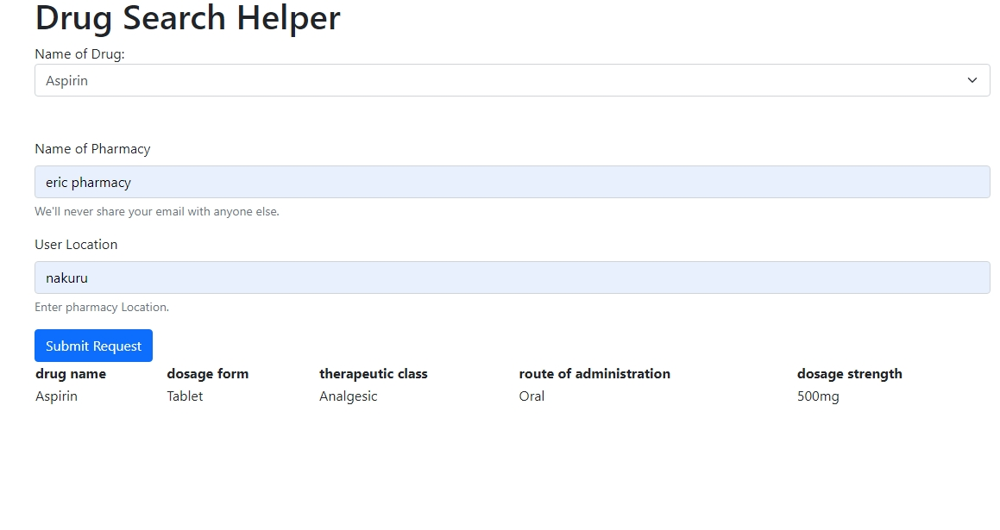

Portfolio project- Drug Search Helper

This project seeks to make it easier for people to get drugs/medication in a timely manner.
Author: ERIC IIJA IMAAMI, email eroija@gmail.com
blog link: https://www.linkedin.com/posts/eric-imamai-61494a25a_blog-post-to-my-portfolio-project-drug-search-activity-7216310085721993216-VRz4?utm_source=share&utm_medium=member_desktop

Project: DRUG SEARCH HELPER

Introduction
Inspiration: Imagine a scenario where someone urgently needs a specific medication. They’re already stressed, and the last thing they want is to spend hours searching for nearby pharmacies or waiting in long queues. That’s where “DRUG SEARCH HELPER” comes in. Inspired by real-life situations, I set out to create an application that simplifies the process of finding drugs quickly.

Technical Challenge: The technical challenge was twofold:

Real-Time Data: How could I provide up-to-date information on drug availability and nearby pharmacies? This required scraping data from reliable sources.
User Experience: How could I make the app intuitive and user-friendly? I wanted to minimize clicks, provide clear instructions, and ensure a seamless experience.
The Journey
1. Ideation and Planning
Timeline: I started this project during a particularly rainy week in June. The gloomy weather fueled my determination to create something useful.
Sketches and Wireframes: I scribbled rough sketches of the app’s interface, emphasizing simplicity. I wanted users to open the app, type the drug name, and instantly see nearby options.
Emotion: I imagined a worried parent searching for their child’s prescribed medication. The urgency and empathy drove my decisions.
2. Technical Implementation
Backend (Flask)
Why Flask?: Flask’s lightweight nature appealed to me. It allowed me to focus on functionality without unnecessary complexity.
Routes and Controllers: I defined routes for search queries, pharmacy details, and authentication. Each route had a corresponding controller function.
Database: I used MySQL to store drug information, pharmacy locations, and availability.
External APIs: I integrated with pharmacy APIs to fetch real-time data. The challenge was handling rate limits and ensuring reliability.
Frontend (HTML, CSS, JavaScript)
Minimalistic Design: I opted for a clean, minimalistic UI. A search bar, results list, and map were the core components.
AJAX Requests: JavaScript made asynchronous requests to the backend, updating the UI without page reloads.
Geolocation: I used the browser’s geolocation API to find nearby pharmacies.
3. Struggles and Learnings
Database Queries: Writing efficient SQL queries was harder than expected. Indexing and optimizing became my late-night companions.
Error Handling: I learned to handle edge cases gracefully. What if the API returned no results? What if the user denied location access?
Feedback Loop: I shared my progress with friends and family. Their feedback shaped the app’s usability.
4. Next Iteration
User Profiles: Allow users to save their preferred pharmacies and track availability over time.
Notifications: Send alerts when a pharmacy restocks a drug.
Accessibility: Improve screen reader compatibility and keyboard navigation.
Conclusion
“DRUG SEARCH HELPER” isn’t just code; it’s empathy, urgency, and the desire to make a difference. As you explore this project, remember the rain-soaked days when it all began. Let’s build a world where finding essential medications is as simple as a few clicks.